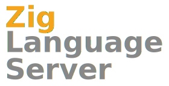

Zig Language Server, or `zls`, is a language server for Zig. The Zig wiki states that "The Zig community is decentralized" and "There is no concept of 'official' or 'unofficial'", so instead of calling `zls` unofficial, and I'm going to call it a cool option, one of [many](https://github.com/search?q=zig+language+server).

<!-- omit in toc -->
## Table Of Contents

- [Installation](#installation)
  - [Build Options](#build-options)
  - [Configuration Options](#configuration-options)
- [Usage](#usage)
  - [VSCode](#vscode)
  - [Sublime Text 3](#sublime-text-3)
  - [Kate](#kate)
  - [Neovim/Vim8](#neovimvim8)
  - [Emacs](#emacs)
  - [Doom Emacs](#doom-emacs)
- [Related Projects](#related-projects)
- [License](#license)

## Installation

Installation starts with downloading an official release from the [Releases page](https://github.com/zigtools/zls/releases).  
Up to date builds from master branch are also available in the latest successful CI run, contained in the `builds` artifact.

See [Downloading and Building ZLS](https://github.com/zigtools/zls/wiki/Downloading-and-Building-ZLS) on the Wiki, or the page about [using ZLS with Visual Studio Code](https://github.com/zigtools/zls/wiki/Installing-for-Visual-Studio-Code) for a guide to help get `zls` running in your editor.

### Installing binaries

#### MacOS

You can install the latest release into `$HOME/zls` using e.g.:

```sh
brew install xz
mkdir $HOME/zls && cd $HOME/zls && curl -L https://github.com/zigtools/zls/releases/download/0.1.0/x86_64-macos.tar.xz | tar -xJ --strip-components=1 -C .
```

#### Linux

You can install the latest release into `$HOME/zls` using e.g.:

```
sudo apt install xz-utils
mkdir $HOME/zls && cd $HOME/zls && curl -L https://github.com/zigtools/zls/releases/download/0.1.0/x86_64-linux.tar.xz | tar -xJ --strip-components=1 -C .
```

### From Source

Building `zls` is very easy. You will need [a build of Zig master](https://ziglang.org/download/) to build zls.

```bash
git clone --recurse-submodules https://github.com/zigtools/zls
cd zls
zig build -Drelease-safe
./zig-cache/bin/zls config # Configure ZLS
```

*For detailed building instructions, see the Wiki page about [Cloning With Git](https://github.com/zigtools/zls/wiki/Downloading-and-Building-ZLS#cloning-with-git).*

#### Build Options

<!-- When updating this table, be sure to copy changes to the Wiki page about building from source. -->
<!-- If this table grows too large, then delete this one and move it all over to the Wiki page about building from source. -->
| Option | Type | Default Value | What it Does |
| --- | --- | --- | --- |
| `-Ddata_version` | `string` (master, 0.7.0 or 0.7.1) | master | The data file version. This selects the files in the `src/data` folder that correspond to the Zig version being served.|

### Configuration Options

You can configure zls by running `zls config` or manually creating your own `zls.json` configuration file.  
zls will look for a zls.json configuration file in multiple locations with the following priority:  
- In the local configuration folder of your OS (as provided by [known-folders](https://github.com/ziglibs/known-folders#folder-list))  
- In the global configuration folder of your OS (as provided by [known-folders](https://github.com/ziglibs/known-folders#folder-list))

The following options are currently available.  

| Option | Type | Default value | What it Does |
| --- | --- | --- | --- |
| `enable_snippets` | `bool` | `false` | Enables snippet completions when the client also supports them. |
| `zig_lib_path` | `?[]const u8` | `null` | zig library path, e.g. `/path/to/zig/lib/zig`, used to analyze std library imports. |
| `zig_exe_path` | `?[]const u8` | `null` | zig executable path, e.g. `/path/to/zig/zig`, used to run the custom build runner. If `null`, zig is looked up in `PATH`. Will be used to infer the zig standard library path if none is provided. |
| `warn_style` | `bool` | `false` | Enables warnings for style *guideline* mismatches |
| `build_runner_path` | `?[]const u8` | `null` | Path to the build_runner.zig file provided by zls. `null` is equivalent to `${executable_directory}/build_runner.zig` |
| `build_runner_cache_path` | `?[]const u8` | `null` | Path to a directroy that will be used as zig's cache when running `zig run build_runner.zig ...`. `null` is equivalent to `${KnownFloders.Cache}/zls` |
| `enable_semantic_tokens` | `bool` | `true` | Enables semantic token support when the client also supports it. |
| `operator_completions` | `bool` | `true` | Enables `*` and `?` operators in completion lists. |
| `skip_std_references` | `bool` | `false` | When true, skips searching for references in std. Improves lookup speed for functions in user's code. Renaming and go-to-definition will continue to work as is.

## Features

`zls` supports most language features, including simple type function support, usingnamespace, payload capture type resolution, custom packages and others. 
Notable language features that are not currently implemented include `@cImport` as well as most forms of compile time evaluation.  

The following LSP features are supported:  
- Completions
- Hover
- Goto definition/declaration
- Document symbols
- Find references
- Rename symbol
- Formatting using `zig fmt`
- Semantic token highlighting (LSP 3.16 proposed feature, implemented by a few clients including VSCode, kak and emacs lsp-mode)

You can install `zls` using the instuctions for your text editor below:  

### VSCode

Install the `zls-vscode` extension from [here](https://github.com/zigtools/zls-vscode/releases) and provide a path to the build `zls` executable.

### Sublime Text 3

- Install the `LSP` package from [here](https://github.com/sublimelsp/LSP/releases) or via Package Control.
- Add this snippet to `LSP's` user settings:

```json
{
    "clients": {
        "zig":{
            "command": ["zls"],
            "enabled": true,
            "languageId": "zig",
            "scopes": ["source.zig"],
            "syntaxes": ["Packages/Zig Language/Syntaxes/Zig.tmLanguage"]
        }
    }
}
```

### Kate

- Enable `LSP client` plugin in Kate settings.
- Add this snippet to `LSP client's` user settings (e.g. /$HOME/.config/kate/lspclient)
  (or paste it in `LSP client's` GUI settings)

```json
{
    "servers": {
        "zig": {
            "command": ["zls"],
            "url": "https://github.com/zigtools/zls",
            "highlightingModeRegex": "^Zig$"
        }
    }
}
```

### Neovim/Vim8
#### CoC

- Install the CoC engine from [here](https://github.com/neoclide/coc.nvim).
- Issue `:CocConfig` from within your Vim editor, and the following snippet:

```json
{
   "languageserver": {
       "zls" : {
           "command": "command_or_path_to_zls",
           "filetypes": ["zig"]
       }
   }
}
```

#### YouCompleteMe
- Install YouCompleteMeFrom [here](https://github.com/ycm-core/YouCompleteMe.git).
- Add these lines to your vimrc:

```vim
"ensure zig is a recognized filetype
autocmd BufNewFile,BufRead *.zig set filetype=zig

let g:ycm_language_server = 
  \ [ 
  \{
  \     'name': 'zls',
  \     'filetypes': [ 'zig' ],
  \     'cmdline': [ '/path/to/zls_executable' ]
  \    }
  \ ]
```

#### nvim-lspconfig

Requires Nvim 0.5 (HEAD)!

- Install nvim-lspconfig from [here](https://github.com/neovim/nvim-lspconfig).
- Install zig.vim from [here](https://github.com/ziglang/zig.vim).

nvim-lspconfig already ships a configuration for zls. A simple `init.vim` might look like this:
```vim
call plug#begin('~/.config/nvim/plugged')
Plug 'neovim/nvim-lspconfig'
Plug 'nvim-lua/completion-nvim'
Plug 'ziglang/zig.vim'
call plug#end()

:lua << EOF
    local lspconfig = require('lspconfig')

    local on_attach = function(_, bufnr)
        vim.api.nvim_buf_set_option(bufnr, 'omnifunc', 'v:lua.vim.lsp.omnifunc')
        require('completion').on_attach()
    end

    local servers = {'zls'}
    for _, lsp in ipairs(servers) do 
        lspconfig[lsp].setup {
            on_attach = on_attach,
        }
    end
EOF

" Set completeopt to have a better completion experience
set completeopt=menuone,noinsert,noselect

" Enable completions as you type
let g:completion_enable_auto_popup = 1
```

#### LanguageClient-neovim

- Install the LanguageClient-neovim from [here](https://github.com/autozimu/LanguageClient-neovim)
- Edit your neovim configuration and add `zls` for zig filetypes:

```vim
let g:LanguageClient_serverCommands = {
       \ 'zig': ['~/code/zls/zig-cache/bin/zls'],
       \ }
```

### Emacs

- Install [lsp-mode](https://github.com/emacs-lsp/lsp-mode) from melpa
- [zig mode](https://github.com/ziglang/zig-mode) is also useful

```elisp
;; Setup lsp-mode as desired.
;; See https://emacs-lsp.github.io/lsp-mode/page/installation/ for more information.
(require 'lsp-mode)

;; Either place zls in your PATH or add the following:
(setq lsp-zig-zls-executable "<path to zls>")
```

### Doom Emacs

- Enable the `lsp` module
- Install the [zig-mode](https://github.com/ziglang/zig-mode) package (add `(package! zig-mode)` to your `packages.el` file

```elisp
(use-package! zig-mode
  :hook ((zig-mode . lsp-deferred))
  :custom (zig-format-on-save nil)
  :config
  (after! lsp-mode
    (add-to-list 'lsp-language-id-configuration '(zig-mode . "zig"))
    (lsp-register-client
      (make-lsp-client
        :new-connection (lsp-stdio-connection "<path to zls>")
        :major-modes '(zig-mode)
        :server-id 'zls))))
```

## Related Projects

- [`sublime-zig-language` by @prime31](https://github.com/prime31/sublime-zig-language)
  - Supports basic language features
  - Uses data provided by `src/data` to perform builtin autocompletion
- [`zig-lsp` by @xackus](https://github.com/xackus/zig-lsp)
  - Inspiration for `zls`
- [`known-folders` by @ziglibs](https://github.com/ziglibs/known-folders)
  - Provides API to access known folders on Linux, Windows and Mac OS

## License

MIT
